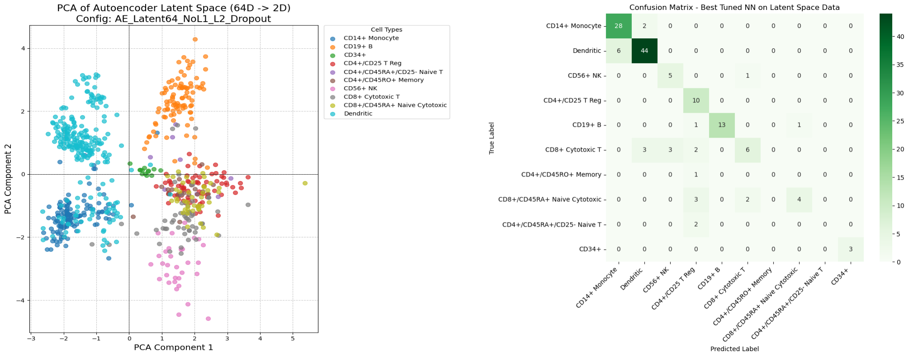

# scRNA-Seq-Classifier

The scRNA-Seq-Classifier is a set of tools for running analysis of scRNA-Seq data to predict cell types. This repo feature an autoencoder trained on scRNA data to generate latent representations, and an MLP for cell type classification. These tools are packaged as a streamlit app for ease of use. 

To run these models, clone this github repo and initialize the enviornment: 
```
git clone https://github.com/nathanlanclos/scRNA-Seq-Classifier
cd scRNA-Seq-Classifier
conda env create -f environment.yml
```
To run the Streamlit webapp: 
```
cd scRNA-Seq-Classifier
streamlit run streamlit.py
```
